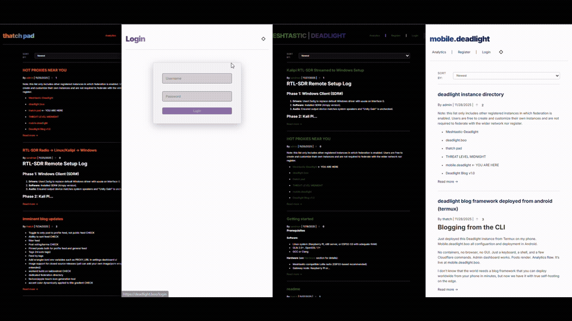
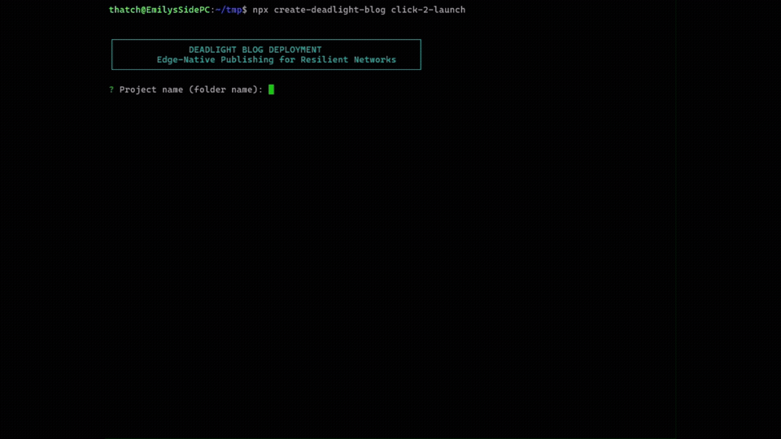

# Deadlight Blog | Edge-Native Publishing for Resilient Networks


[Manifesto](#why-this-exists) · [Key Features](#key-features) · [Quick Start](#quick-start) · [Use Cases](#use-cases) · [Configuration](#configuration) · [The Deadlight Ecosystem](docs/ECOSYSTEM.md) · [Middleware](docs/MIDDLEWARE.md) · [Roadmap](#roadmap) · [Security](#security) · [Documentation](#documentation)

> Built for the 80% of the internet that isn't fiber and datacenters. **3–8 KB pages · Zero JS Required · Deployable from an Android Phone via Termux**



## Quick Start

Deploy a fully functional, production-ready instance in under 2 minutes using the interactive launcher.

```bash
npx create-deadlight-blog my-blog
```

*This handles cloning, authentication, database creation, schema migration, and admin user seeding automatically.*



### Post-Deployment
Your blog is now live on the edge.
1. Go to `https://your-project.pages.dev/admin`
2. Log in with the credentials you set during setup
3. Write your first post

Full getting started for all platoforms: [docs/QUICKSTART.md](docs/QUICKSTART.md)
For Andrioid/Raspberry PI: [docs/ARM64_QUICKSTART.md](docs/ARM64_QUICKSTART.md)

## Live Demos

- **[deadlight.boo](https://deadlight.boo)** – Full-featured instance with admin dashboard
- **[thatch-dt.deadlight.boo](https://thatch-dt.deadlight.boo)** – Zero-JS minimal theme (perfect for lynx/slow links)
- **[meshtastic.deadlight.boo](https://meshtastic.deadlight.boo)** – Blog published over LoRa mesh
- **[mobile.deadlight.boo](https://mobile.deadlight.boo)** - Instance published and managed entirely from Android via Termux
- **[threat-level-midnight.deadlight.boo](https://threat-level-midnight.deadlight.boo)** – Federation testing instance

## Why this exists

Most blogging platforms assume you have reliable connectivity, cheap power, and modern browsers. **The rest of the planet doesn't.**

| The internet most people actually have | Why Ghost/WordPress/Substack die here | How Deadlight just works |
|----------------------------------------|--------------------------------------|--------------------------|
| **300–3000 ms latency**<br>(Starlink, LoRa, HF, mesh) | 400 KB of JS + hydration before you see text | <10 KB semantic HTML + optional CSS. Loads before the first satellite ACK |
| **Connectivity drops for hours** | Needs 30–60s of stable link to render a post | Fully readable offline after first visit. New posts need ~4 seconds of uplink |
| **Text-only clients**<br>(Meshtastic, packet radio, lynx) | 99% of modern blogs are JavaScript-only | 100% functional in w3m, links, or a 300-baud terminal |
| **Power is scarce**<br>(solar Pi, phone in the desert) | Always-on containers burn watts for nothing | Zero compute when idle. D1 + Workers sleep completely |
| **Hostile networks**<br>(DPI, censorship, no DNS) | Third-party analytics + CDN beacons = instant fingerprint | Zero external requests by default. Prevents fingerprinting and bypasses DNS blackouts |
| **You might post over email, SMS, or LoRa** | Normal dashboards require browser + stable link | Admin dashboard works over SMTP/IMAP. Post from a burner address if needed |

**Deadlight isn't trying to be the coolest blog platform.**  
**It's trying to be the last one on after the lights go out.**

## Part of the Deadlight Ecosystem

blog.deadlight is the **content and federation layer** of the Deadlight edge platform.
It works standalone, but unlocks its full potential when combined with:

- **proxy.deadlight** – Protocol bridge (enables email posting, SMTP-less notifications)
- **meshtastic.deadlight** – LoRa gateway (post from mesh networks)
- **lib.deadlight** – Shared libraries (auth, queuing, federation)


```
┌─────────────────────────────────────────────────────────┐
│                   Deadlight Ecosystem                   │
└─────────────────────────────────────────────────────────┘

    ┌──────────────┐         ┌──────────────┐         ┌──────────────┐
    │    proxy     │◄───────►│     blog     │◄───────►│  meshtastic  │
    │  .deadlight  │  queue  │  .deadlight  │ gateway │  .deadlight  │
    │              │         │   (CORE)     │         │              │
    │ SMTP/IMAP/   │         │ Content &    │         │  LoRa ↔ Net  │
    │ SOCKS/VPN    │         │ Federation   │         │              │
    └──────────────┘         └──────────────┘         └──────────────┘
           │                        │                        │
           └────────────────────────┼────────────────────────┘
                                    │
                         ┌──────────▼──────────┐
                         │   lib.deadlight     │
                         │  Shared Libraries   │
                         └─────────────────────┘

Modes:  [Standalone: blog only]  [Connected: +proxy]  [Full Stack: all]
```

**Standalone mode:** Zero-dependency blogging on Cloudflare's edge  
**Connected mode:** Post via email/LoRa, federate with other instances  
**Full platform:** [edge.deadlight](https://github.com/gnarzilla/edge.deadlight) orchestrates everything

[Jump to ecosystem details ↓](docs/ECOSYSTEM.md)

## Use Cases

### Disaster Response (Standalone Blog)
- Deploy blog in 5 minutes
- Post updates via admin dashboard
- Public reads over degraded networks
- **No additional components needed**

### Field Updates (Blog + Proxy)
- Team posts via satellite email
- Proxy bridges SMTP → blog queue
- Updates appear when connectivity restored
- **Requires: blog.deadlight + proxy.deadlight**

### Mesh Network Publishing (Blog + Proxy + LoRa Gateway)
- Post from Meshtastic node
- Gateway bridges LoRa → Internet
- Content federates to other Deadlight instances
- **Requires: Full stack**

### Off-Grid Operations
- Solar-powered Raspberry Pi as local admin interface
- Sync posts when satellite uplink available
- Zero ongoing power consumption (Workers sleep when idle)
- Works with intermittent connectivity

### Privacy-Focused Publishing
- No third-party trackers or analytics
- Optional Tor/I2P access via proxy.deadlight
- Self-hosted email via SMTP bridge
- Federation without corporate platforms

### Activists in Hostile Networks
- Post via burner email addresses
- No always-on server to raid or subpoena
- Cloudflare's DDoS protection included
- Can operate behind VPN/proxy

### Tested On

- Raspberry Pi 4
- Android (Termux)
- Standard x86_64 Linux/macOS/Windows

### Proof Points

```bash
# Total page weight for a typical post
curl -s https://thatch-dt.deadlight.boo/post/use-cases | wc -c
# → 10,347 bytes (including HTML structure)

# Time to first byte over satellite internet (600ms RTT)
curl -w "%{time_total}\n" -o /dev/null -s https://deadlight.boo
# → 3.182007s (compare to 8–15s for typical JS-heavy blogs)

# Works in text-only browsers
lynx -dump https://thatch-dt.deadlight.boo/post/use-cases | head -20
                           [1]Use Cases | thatch pad

   [2]Analytics | [3]Register | [4]Login

   (BUTTON) ♤

Use Cases

   By [5]thatch | 9/16/2025
   0

Use Case 1: The Privacy-Conscious Blogger

   Sarah wants to blog about digital privacy but doesn't trust traditional
   platforms

   Without Deadlight:

   Pays $10-20/month for "privacy-focused" hosting
   Still has to trust the hosting provider with her data
# → Fully readable, zero layout breakage
```

### Technology Stack

- **Cloudflare Workers** – Globally distributed compute that sleeps when idle
- **D1 (SQLite at the edge)** – Fast, low-cost persistence with no cold starts
- **Markdown → HTML** – Clean semantic output, zero client-side rendering
- **JWT auth** – Role-based access control (admin/editor/viewer)
- **Zero third-party requests** – No analytics beacons, no fingerprinting

### Deployment Topologies

| Topology | Infrastructure | Anonymity | Resilience | Best For |
| :--- | :--- | :--- | :--- | :--- |
| **The Ghost** (Standalone) | Cloudflare Workers + D1 | **High** (Hidden origin, shared IP) | **Medium** (Dependent on CF) | Whistleblowers, Public Blogs |
| **The Bunker** (Local) | `workerd` + SQLite (Local Hardware) | **Variable** (Depends on your net) | **High** (You own the hardware) | Archives, Offline LANs |
| **The Hybrid** (Full Stack) | CF Frontend + Local Proxy | **High** | **Maximum** (Best of both) | Mesh Networks, NGOs |

### Project Structure

```
deadlight/
├── blog.deadlight/          # Main blog application
│   └── src/
│       ├── assets/          # Static media
│       ├── config.js        # Runtime configuration
│       ├── index.js         # Main entry & routing
│       ├── middleware/      # Auth, analytics, error handling, logging
│       ├── routes/          # All endpoint handlers
│       │   ├── admin.js
│       │   ├── auth.js
│       │   ├── blog.js
│       │   ├── inbox.js     # Email bridge endpoints
│       │   ├── proxy.js     # Proxy management dashboard
│       │   └── ...
│       ├── services/        # External service integration
│       ├── templates/       # HTML templates (no build step)
│       └── utils/
└── lib.deadlight/           # Shared library
    └── core/
        ├── auth/            # Authentication system
        ├── db/              # Database models & queries
        ├── security/        # CSRF, rate limiting, headers
        └── ...
```

### Core Design Principles

1. **Text-first** – No media management complexity. Markdown posts, HTML output.
2. **Stateless by default** – Every request is self-contained. No session stickiness required.
3. **Offline-first reading** – After first load, posts are readable without connectivity.
4. **Protocol-agnostic administration** – Manage via browser, curl, or SMTP. Your choice.
5. **Zero external dependencies at runtime** – No CDN requests, no tracking pixels, no font servers.

## Key Features
### For Readers
- **Near-zero latency** – Cloudflare's global edge network
- **Works offline** – Readable after first visit, even without connectivity
- **Text-only compatible** – Full functionality in lynx, w3m, links
- **No JavaScript required** – Optional progressive enhancement only
- **No tracking** – Zero third-party requests by default

### For Publishers
- **Markdown authoring** – Simple, portable, version-controllable
- **Post via email** – SMTP → new article (alpha, testing)
- **Global distribution** – Instant worldwide availability
- **Private analytics** – Per-instance, no external beacons
- **Role-based access** – Admin/editor/viewer permissions
- **CSRF-protected forms** – All mutating actions secured with tokens
- **Rate-limited voting** – Anti-spam protection (10 votes/hour)
- **Comment moderation** – Rate-limited to 5 comments/hour per user

### For Operators
- **Zero always-on costs** – Workers sleep when idle
- **Deploy from a phone** – Full Termux/ARM64 support
- **Proxy integration** – Manage local infrastructure from dashboard
- **Federation ready** – Blog-to-blog communication (alpha)
- **Audit-friendly** – ~8 npm dependencies, readable in an afternoon

## The Eject Button (Data Sovereignty)

Deadlight uses Cloudflare for anonymity and global distribution ("The Cloak"), but we refuse to let it become a dependency cage.

**You can take your data and leave at any time.**

An "Eject" script that downloads your remote D1 database, converts it to standard SQLite, and generates a Docker configuration to run your blog locally or on a VPS.

```bash
# Downloads production DB -> local SQLite -> Docker container
./scripts/eject.sh
```

**Result:** A folder containing your entire blog history and a `docker-compose.yml` file. You can run `docker compose up` immediately to have a pixel-perfect copy of your site running offline on localhost, with zero Cloudflare dependencies.

*Useful for: Local archiving, moving to a physical server, or emergency backups.*

## Security

Deadlight implements multiple layers of protection while maintaining its zero-JS, low-bandwidth philosophy:

### **CSRF Protection**
All forms include anti-CSRF tokens validated server-side:
- Login/registration forms
- Post creation/editing
- Vote buttons (upvote/downvote)
- Comment submissions
- Admin actions (delete, user management)

### **Rate Limiting**
Configurable per-endpoint limits prevent abuse:
- **Authentication**: 5 login attempts per 15 minutes
- **Voting**: 10 votes per hour per user
- **Comments**: 5 comments per hour per user
- **API calls**: 60 requests per minute (configurable)

Rate limiting can be **disabled** when running behind `proxy.deadlight`, which handles rate limiting at the gateway level.

### **Access Control**
- **Role-based permissions**: Admin, Editor, Viewer
- **Private posts**: Visibility controls per-post
- **JWT authentication**: Secure, stateless sessions
- **Admin-only routes**: Protected via middleware

### **Security Headers**
All responses include hardened headers:
```toml
X-Content-Type-Options: nosniff
X-Frame-Options: DENY
X-XSS-Protection: 1; mode=block
Referrer-Policy: strict-origin-when-cross-origin
Content-Security-Policy: default-src 'self'
```

### **Input Validation**
Server-side validation for all user input:
- **Markdown sanitization (XSS prevention)**
- **SQL Injection protection via prepared statements**
- **Username/password strength requirements**
- **Slug format validation**

## Configuration

### Deployment Modes

blog.deadlight adapts based on available components:

**Standalone Mode** (default)
- Web-based posting
- Admin dashboard
- Federation (via HTTP)
- ~Email posting~
- ~Email notifications~
- ~LoRa publishing~

**Connected Mode** (with proxy.deadlight)
- Everything in standalone
- Email posting (via SMTP bridge)
- Email notifications (via queue)
- Federation (via HTTP + email fallback)
- ~LoRa publishing~

**Full Stack Mode** (with proxy + meshtastic)
-  Everything above
-  LoRa publishing (via mesh gateway)
-  Multi-protocol federation

### Basic Setup

Edit `src/config.js` after deployment:

```javascript
export const CONFIG = {
  siteName: 'your site name here',
  siteDescription: 'Letters from Mars',
  postsPerPage: 10,
  theme: 'minimal', // or 'default'
  enableComments: true,
  enableFederation: false, // alpha
  
  // Security settings
  enableRegistration: false,  // Public signups
  requireLoginToRead: false,  // Private blog mode
  maintenanceMode: false
};
```

Or configure dynamically at `your-blog.tld/admin/settings` after authentication.

### Detecting Components

The blog auto-detects available services:
```javascript
// In src/config.js
export const CONFIG = {
  // ... other config
  
  // Auto-detected at runtime
  proxyAvailable: false,  // Set by /api/health check
  meshAvailable: false,   // Set by /api/mesh/status check
  
  // Feature flags (enable based on available components)
  enableEmailPosting: false,    // Requires proxy
  enableEmailNotifications: false,  // Requires proxy
  enableLoRaPosting: false,     // Requires mesh gateway
};
```

### Working Together: Real Scenarios

**Scenario 1: Blogging over LoRa**
1. Write post on phone connected to Meshtastic node
2. Send via SMTP (could be over LoRa → meshtastic.deadlight gateway)
3. Gateway forwards to blog.deadlight inbox endpoint
4. Post published globally via Cloudflare Workers

**Scenario 2: Self-hosted email + edge blog**
1. Run proxy.deadlight locally (bridges SMTP/IMAP)
2. Configure blog.deadlight to use your proxy for outbound email
3. Receive replies to blog posts in your self-hosted inbox
4. Respond via normal email client
5. Blog federates with other Deadlight instances

**Scenario 3: Disaster response team**
1. Deploy blog.deadlight for team updates
2. Team members post via satellite email when web is down
3. Public reads blog over intermittent 2G/3G
4. Zero server infrastructure required on-site

Deadlight is designed for maximum resilience with minimum complexity.

### Advanced Configuration

See `wrangler.toml` for:
- Custom domain routing
- D1 database bindings
- Environment variables
- Asset handling

See [docs/SAMPLE_wrangler.md](docs/SAMPLE_wrangler.toml) for full examples.

### Security Settings

Adjust in shared library `lib.deadlight/core/security/`:
- **Rate limits** – `ratelimit.js` (default: 100 req/hour per IP)
- **Validation rules** – `validation.js` (input sanitization)
- **Security headers** – `headers.js` (CSP, HSTS, etc.)

## Administration
### Creating Your First Admin User

```bash
# Interactive mode (local or remote)
./scripts/gen-admin/seed-dev.sh -v

# Force remote (for ARM64 deployments)
./scripts/gen-admin/seed-dev.sh -v -r

# Manual via SQL (if needed)
npx wrangler d1 execute my-blog --remote --command \
  "INSERT INTO users (username, password_hash, role) 
   VALUES ('admin', 'bcrypt-hash-here', 'admin')"
```

### Admin Dashboard

Access at `your-blog.tld/admin`:
- Create/edit/delete posts
- Manage users and permissions
- Configure site settings
- View analytics (private, per-instance)
- Control proxy settings (if proxy.deadlight is running)

### Publishing Workflows

**Via Web Dashboard** (standard)
```
your-blog.tld/admin/posts/new
→ Write Markdown
→ Publish
```

**Via Email** (alpha, requires proxy.deadlight)
```
From: you@domain.tld
To: inbox@your-blog.tld
Subject: New Post Title

Post content in Markdown...
```

**Via API** (for automation)
```bash
curl -X POST https://your-blog.tld/api/posts \
  -H "Authorization: Bearer $JWT_TOKEN" \
  -H "Content-Type: application/json" \
  -d '{"title":"My Post","content":"# Hello\n\nWorld"}'
```

See [docs/API.md](docs/API.md) for full endpoint documentation.

## Roadmap
### Production-Ready
- Core blogging (posts, pages, archives)
- Markdown rendering with XSS protection
- User authentication & role-based access
- Admin dashboard
- Private analytics
- **CSRF protection on all forms**
- **Rate limiting (votes, comments, auth)**
- **Middleware security layer**
- ARM64 deployment support

### Alpha / Testing
- Post-by-email (SMTP inbox processing)
- Blog-to-blog federation via email protocols
- Full proxy.deadlight dashboard integration
- Comment system (with rate limiting)

### Planned 
- **2026 Q1** – Stable post-by-email + comments
- **2026 Q2** – Full proxy dashboard integration
- **2026 Q3** – Meshtastic-native posting client and Visual Edge Network Topology integration.
- **2027** – ActivityPub federation, plugin architecture

### Help Wanted
Open to contributions via issues or PRs. Priority areas:
- Testing email workflows on various providers
- Documentation improvements
- Accessibility enhancements
- Translations (i18n)

## API Documentation
### Authentication
```bash
# Login
curl -X POST https://your-blog.tld/api/auth/login \
  -H "Content-Type: application/json" \
  -d '{"username":"admin","password":"secret"}'
# → Returns JWT token

# Use token
curl https://your-blog.tld/api/posts \
  -H "Authorization: Bearer YOUR_JWT_TOKEN"
```

### Posts
```bash
# List posts
GET /api/posts?page=1&limit=10

# Get single post
GET /api/posts/:id

# Create post (requires auth)
POST /api/posts
{
  "title": "My Post",
  "content": "# Hello\n\nMarkdown content...",
  "published": true
}

# Update post (requires auth)
PUT /api/posts/:id

# Delete post (requires auth)
DELETE /api/posts/:id
```

Full API documentation: [docs/API.md](docs/API.md)

## Who's this for
- Myself, first and foremost. I didn't build this framework for any other intention than for my own personal use, and its quirks likely reflect that.

**Choose Deadlight if you:**
- Need a blog that works over terrible connectivity
- Want zero always-on server costs
- Value privacy and minimal third-party dependencies
- Need to deploy/manage from a phone or low-power device
- Want to integrate blogging with mesh networks or amateur radio
- Need text-only client compatibility
- Want a platform you can actually audit and understand

**Look elsewhere if you:**
- Need rich media galleries (Deadlight is deliberately text-first)
- Want out-of-the-box social media integrations
- Need a WordPress plugin ecosystem
- Require a visual page builder
- Want a fully GUI-based setup with no terminal required

## Support

**[Support on Ko-fi](https://ko-fi.com/gnarzilla)**

Other ways to help:
-  Star the repo
-  File bug reports
-  Improve documentation
-  Submit PRs
-  Tell others who might need this

## Documentation

- **[Quick Start](docs/QUICKSTART.md)** – Detailed setup for all platforms
- **[Architecture](docs/ARCHITECTURE.md)** – Technical deep dive
- **[Security](docs/SECURITY.md)** – Full security model and threat analysis
- **[API Reference](docs/API.md)** – Complete endpoint documentation
- **[Middleware](docs/MIDDLEWARE.md)** – Custom middleware development
- **[Ecosystem](docs/ECOSYSTEM.md)** – Integration with proxy/vault/meshtastic
- **[Appendix A: Component Deep Dive](docs/APPENDIXA.md)** - Ecosystem component deep dive
- **[License](docs/LICENSE)** - MIT 2026 deadlight

## Contact

- **GitHub:** [@gnarzilla](https://github.com/gnarzilla)
- **Email:** gnarzilla@deadlight.boo
- **Blog:** [deadlight.boo](https://deadlight.boo)

[EOF](#live-demos)


