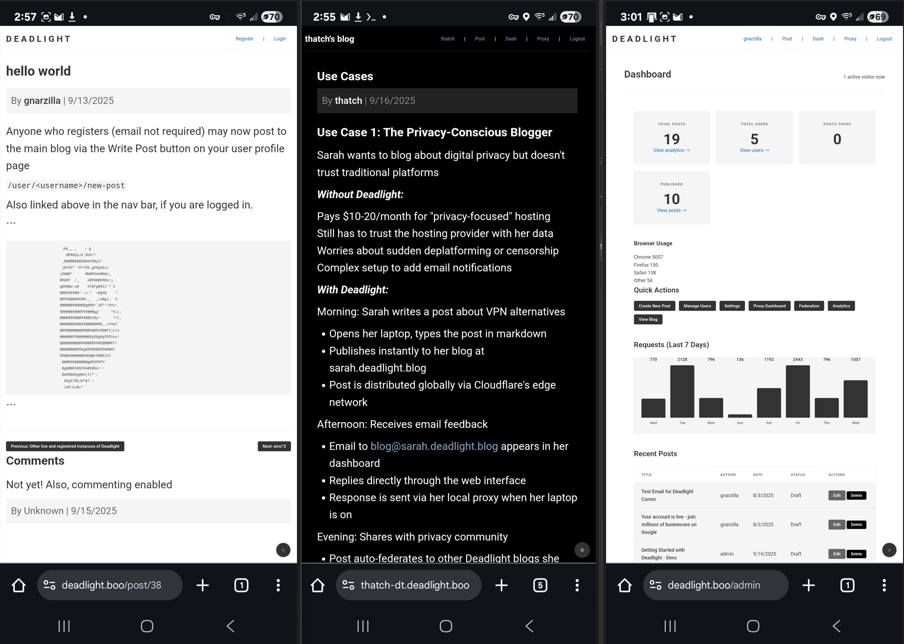
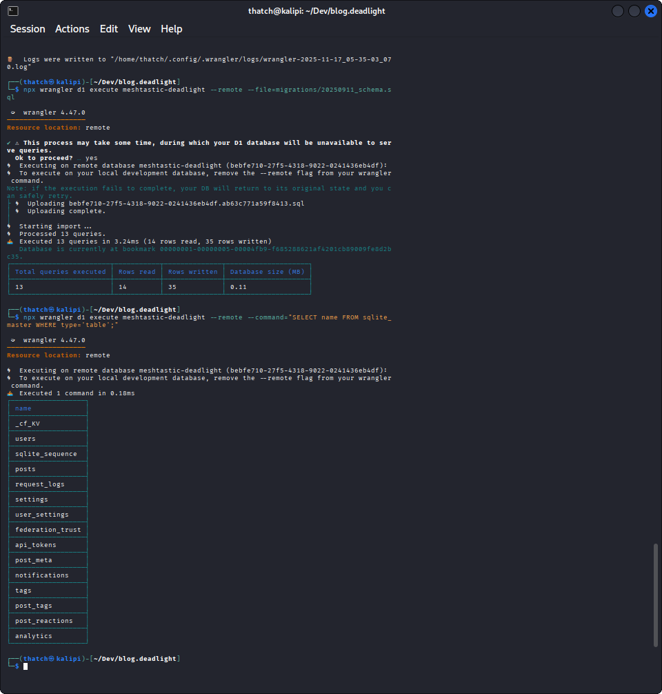

# Deadlight Edge Blog - Secure, Modular Blog Platform with Integrated Proxy Management


[](https://deadlight.boo) Live Demo: [deadlight.boo](https://deadlight.boo) | [Separate Instance Deployment](https://thatch-dt.deadlight.boo) | [Other Separate Instance](https://threat-level-midnight.deadlight.boo)

A modular, security-hardened blog platform built on Cloudflare Workers with integrated multi-protocol proxy server management. Features real-time proxy control, email federation capabilities, localized real-time analytics. [Getting Started with Deadlight](https://deadlight.boo/post/47)

---

### Table of Contents
-  [Key Features](#key-features)
-  [Architecture](#architecture)
-   [Quick Start](#quick-start)
-  [Configuration](#configuration)
-  [Deploy](#deploy)
-  [API Documentation](#api-documentation)
-  [Roadmap](#roadmap)
-  [License](docs/LICENSE)
-  [Support](#support) 



[Use case examples](https://thatch-dt.deadlight.boo/post/use-cases)

---


## Key Features

### **Performance & Content**
- **Near-zero latency**: Deployed on Cloudflare Workers to deliver content globally in milliseconds.
- **D1 Database**: Uses D1 (SQLite at the edge) for fast, low-cost data access.
- **Full Markdown support**: Write posts using a simple, intuitive syntax.
- **SEO-friendly**: Generates clean URLs and post excerpts for better discoverability.

### **Security & Administration**
- **CSRF & Rate Limiting**: All forms and endpoints are protected against common attacks.
- **Enhanced Authentication**: Secure JWT implementation with role-based access control (admin, editor, viewer).
- **Robust Framework**: Includes a comprehensive validation framework, structured logging, and secure headers for a hardened application.
- **User Management**: A dashboard with a user management interface and activity logging.

### Proxy Integration 
- **Real-time Control**: Manage your local infrastructure from any browser.
- **Email Protocol Bridge**: Connect Cloudflare Workers to your self-hosted email server via SMTP/IMAP.
- **Decentralized Federation**: Test blog-to-blog communication and federation with other domains via email protocols.
- **Privacy Proxy**: Manage proxy access directly from the dashboard.


---

## **Architecture**:
Deadlight is designed as a modular, full-stack application built for maximum flexibility and performance.
- **Modular Architecture**: Shared [lib.deadlight](https://github.com/gnarzilla/lib.deadlight) library and reusable components enable a clean separation of concerns and a multi-app ecosystem.
- **Text-First**: A deliberate design choice to focus on clean, markdown-based content and avoid the complexities of media management.
- **Project Structure**: A clear directory structure that organizes the main application, shared libraries, and core functionality.

```
deadlight/
├── blog.deadlight/          # Main blog application
│   └── src/
|         ├── assets/        # Static site media
|         ├── config.js
|         ├── index.js       # Main entry & routing
|         ├── middleware/    # Application-level middleware
|         │   ├── analytics.js
|         │   ├── auth.js
|         │   ├── error.js
|         │   └── logging.js
|         ├── routes/        # Route handlers for all endpoints
|         │   ├── admin.js
|         │   ├── auth.js
|         │   ├── blog.js
|         │   ├── inbox.js
|         │   ├── index.js
|         │   ├── proxy.js
|         │   ├── static.js
|         │   ├── styles.js
|         │   └── user.js
|         ├── services/      # Extenal service integration
|         │   ├── config.js
|         │   ├── outbox.js
|         │   └── proxy.js
|         ├── styles/
|         ├── templates/     # HTML templates for all pages
|         │   ├── admin/
|         │   ├── auth/
|         │   ├── base.js
|         │   ├── blog/
|         │   ├── landing.js
|         │   └── user/
|         └── utils/
└── lib.deadlight/          # Shared library
    └── core/
        ├── auth/           # Authentication system
        ├── db/             # Database layer
        ├── security/       # Security features
        └── ...
```

## Quick Start

### Prerequisites
- Cloudflare account (free tier works)
- Node.js 20+
- Wrangler CLI (`npm install -g wrangler`)

```bash
git clone https://github.com/gnarzilla/blog.deadlight
cd blog.deadlight
npm install
```

Create your D1 database:
`wrangler d1 create your-db-name`

Initialize the database:
Local development
`wrangler d1 execute your-db-name --local --file=migrations/20250911_schema.sql`

Production
`wrangler d1 execute your-db-name --remote --file=migrations/20250911_schema.sql`



### ARM64-Friendly Quick Start (Raspberry Pi, PinePhone, Android/Termux, etc.)

Wrangler’s **local D1 emulator fails on ARM** due to TCMalloc issues, but you can skip it entirely and bootstrap everything remotely on Cloudflare’s edge. As follows:

```bash
# 1. Install prerequisites
# On Raspberry Pi OS / Kali / Ubuntu:
sudo apt update && sudo apt install nodejs-lts npm git jq openssl-tool

# On Android (Termux):
pkg update && pkg install nodejs-lts git jq openssl-tool

# 2. Clone and enter repo
git clone https://github.com/gnarzilla/blog.deadlight
cd blog.deadlight

# 3. Install deps (root + shared lib)
npm install
cd lib.deadlight && npm install marked xss --save && cd ..

# 4. Log in to Cloudflare
npx wrangler login

# 5. Create & bootstrap remote D1 database (skip local entirely)
npx wrangler d1 create your-db-name         # note the database_id
npx wrangler d1 execute your-db-name --remote --file=migrations/20250911_schema.sql

# 6. Create your admin user (use -r to force remote)
./scripts/gen-admin/seed-dev.sh -v -r

# 7. Set required secrets
openssl rand -base64 32 | wrangler secret put JWT_SECRET
echo "https://your-domain.tld" | wrangler secret put SITE_URL   # or your domain

# 8. Fix assets path in wrangler.toml (if needed)
# Change: directory = "src/static" → directory = "src/assets"

# 9. Deploy!
npx wrangler deploy --env=""     # add --env=your-env if using multiple
```

## Configuration

Configure your domain and bindings in [wrangler.toml](docs/SAMPLE_wrangler.md):

Edit `src/config.js` to customize:

- Site title and description
- Posts per page
- Date formatting
- Theme defaults
- Security settings

Settings can be changed dynamically after deployment at `your-blog.tld/admin/settings`

Configure your local environment in [package.json](docs/SAMPLE_package.json.md)


## Set production secrets:

### Generate a secure JWT secret
```bash
openssl rand -base64 32
wrangler secret put JWT_SECRET
```


## Deploy

```bash
$ wrangler deploy

 ⛅️ wrangler 4.27.0 (update available 4.37.1)
─────────────────────────────────────────────
[custom build] Running: npm install
[custom build]
[custom build] up to date, audited 8 packages in 2s
[custom build]
[custom build]
[custom build] found 0 vulnerabilities
[custom build]
🌀 Building list of assets...
✨ Read 33 files from the assets directory /home/thatch/blog.deadlight/deadlight.boo/src/assets
🌀 Starting asset upload...
🌀 Found 2 new or modified static assets to upload. Proceeding with upload...
+ /admin_dual.png
+ /BlogProxyTunnel.png
Uploaded 1 of 2 assets
Uploaded 2 of 2 assets
✨ Success! Uploaded 2 files (30 already uploaded) (2.09 sec)

Total Upload: 449.87 KiB / gzip: 90.54 KiB
Worker Startup Time: 8 ms
Your Worker has access to the following bindings:
Binding                                                    Resource
env.DB (your-db-name)                                      D1 Database
env.ASSETS                                                 Assets
env.PROXY_URL ("http://localhost:8080")                    Environment Variable
env.SITE_URL ("https://your-domain.tld")                   Environment Variable
env.ENABLE_QUEUE_PROCESSING ("true")                       Environment Variable
env.USE_PROXY_AUTH (true)                                  Environment Variable
env.DISABLE_RATE_LIMITING (true)                           Environment Variable

Uploaded your-domain.tld (9.43 sec)
Deployed your-domain.tld triggers (1.84 sec)
  your-domain.tld/* (zone id: your-cloudflare-zoneid)
  *.your-domain.tld/* (zone id: your-cloudflare-zoneid)
Current Version ID: <hidden>
```
Your site is now accessible at your-domain.tld. Create an admin account to manage administrative settings at `your-domain.tld/admin` and proxy dashboard at `your-domain.tld/admin/proxy`.

### Create your admin user:
```bash
# Generate secure credentials
$chmod +x scripts/gen-admin/seed-dev.sh
$ ./scripts/gen-admin/seed-dev.sh -v
Enter admin username: admin
Enter admin email: admin@your-domain.tld
Enter admin password:
Duplicate check result: 0 existing user(s) found.

 ⛅️ wrangler 4.27.0 (update available 4.28.1)
─────────────────────────────────────────────
🌀 Executing on local database your-db-name (HIDDEN) from .wrangler/state/v3/d1:
🌀 To execute on your remote database, add a --remote flag to your wrangler command.
🚣 2 commands executed successfully.
Admin user created.

# Or manually via SQL
wrangler d1 execute your-db-name --remote --command "INSERT INTO users (username, password_hash, role) VALUES ('admin', 'your-hash-here', 'admin')"

# Add to production database
wrangler d1 execute your-db-name --remote --command "INSERT INTO users (username, password, salt) VALUES ('admin', 'hash-here', 'salt-here')"
```

### Customize styling
Edit theme variables in `src/routes/styles.js`. The CSS uses variables for easy customization.

### Add custom routes
1. Create route handler in src/routes/
2. Register in src/index.js
3. Add templates as needed

### Adjust security settings
- Rate limits: Edit lib.deadlight/core/src/security/ratelimit.js
- Validation rules: Edit lib.deadlight/core/src/security/validation.js
- Security headers: Edit lib.deadlight/core/src/security/headers.js

## API Documentation
[API Endpoints can be found at docs/API.md](docs/API.md)

## Security Headers
All responses include:

- X-Content-Type-Options: nosniff
- X-Frame-Options: DENY
- X-XSS-Protection: 1; mode=block
- Referrer-Policy: strict-origin-when-cross-origin
- Content-Security-Policy (configurable)

## **Roadmap**
- Post comments - active
- Proxy integration - testing
- email bridge/federation - testing
- plugin system - active
- Integrated localized (private) analytics collection and dashboard - active
- **Active Development**: Full email client/server integration, production deployment guides, automatic sitemmap.xml generation

## Support

[Support is greatly appreciated! - ko-fi/gnarzilla](https://ko-fi.com/gnarzilla)

