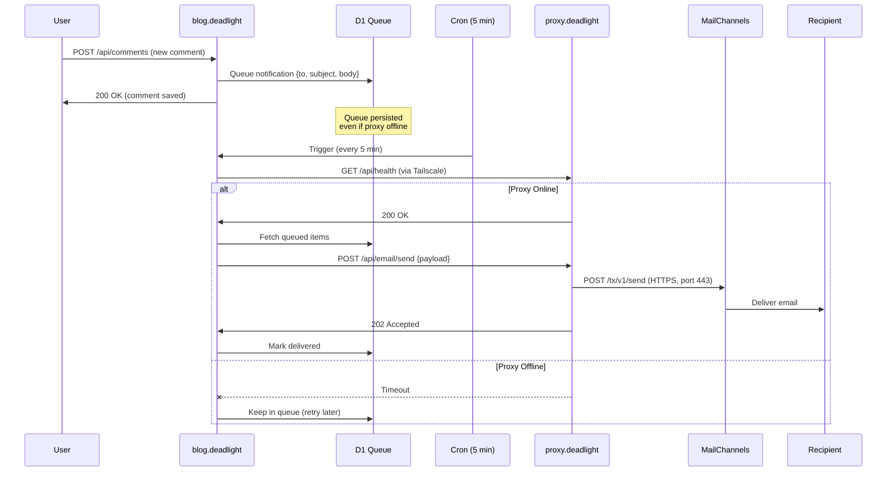

## The Deadlight Ecosystem

The blog is one component of a larger resilience stack:

```
┌─────────────────────────────────────────────┐
│           edge.deadlight                    │  ← Umbrella platform
│  (orchestrates everything below)            │
└─────────────────────────────────────────────┘
           │
           ├──────────────────┬──────────────────┬─────────────────
           ▼                  ▼                  ▼
   ┌───────────────┐  ┌───────────────┐  ┌──────────────────┐
   │blog.deadlight │  │proxy.deadlight│  │meshtastic        │
   │               │  │               │  │  .deadlight      │
   │ Content layer │  │Protocol bridge│  │                  │
   │ (this repo)   │  │SMTP/IMAP/SOCKS│  │LoRa ↔ Internet   │
   │               │  │VPN gateway    │  │bridge            │
   │ JavaScript    │  │ C             │  │ C (proxy fork)   │
   └───────────────┘  └───────────────┘  └──────────────────┘
           │                  │                  │
           └──────────────────┴──────────────────┘
                              │
                              ▼
                   ┌─────────────────────┐
                   │   lib.deadlight     │
                   │                     │
                   │ Shared libraries:   │
                   │ • Auth & JWT        │
                   │ • DB models (D1)    │
                   │ • Security utils    │
                   │ • UI components     │
                   └─────────────────────┘
```

### Component Roles

| Component | Purpose | When You Need It |
|-----------|---------|------------------|
| **blog.deadlight** | Content storage & delivery | Always (core component) |
| **lib.deadlight** | Shared code (auth, queuing, DB) | Always (dependency) |
| **proxy.deadlight** | Protocol bridging | Email posting, federation, self-hosted SMTP |
| **meshtastic.deadlight** | LoRa ↔ Internet gateway | Mesh network publishing |
| **edge.deadlight** | Orchestration layer | Multi-instance deployments |

## Architecture: Blog + Proxy Integration

### Sequence: User Posts Comment


**Key insight:** The blog never directly touches SMTP. The proxy translates HTTP → Email API → SMTP. This is why residential networks (port 25 blocked) still work.
