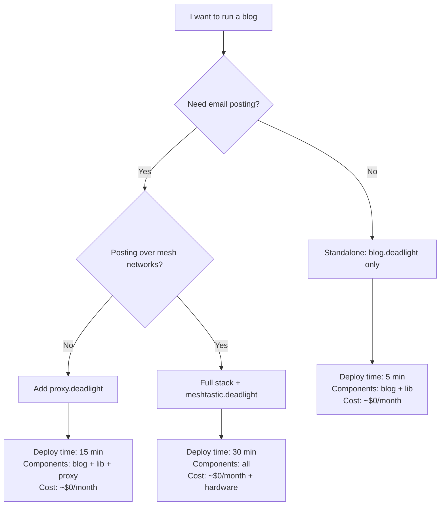

## Getting Started

<Choose based on your needs>

## Choosing Your Deployment


**Start simple, add components as needed.** Everything works standalone.

**Option 1: Standalone Blog (5 minutes)**

Deploy a fully functional, production-ready instance in under 2 minutes using our interactive launcher.

```bash
npx create-deadlight-blog my-blog
```

*This handles cloning, authentication, database creation, schema migration, and admin user seeding automatically.*

Use when: You just want a fast, resilient blog

**Option 2: Blog + Proxy (15 minutes)**
```bash
# Deploy blog (as above)
# Then add proxy:
git clone https://github.com/gnarzilla/proxy.deadlight
cd proxy.deadlight && docker compose up -d
```
Use when: You want email posting, federation, self-hosted SMTP

**Option 3: Full Stack (30 minutes)**
See [edge.deadlight docs](gnarzilla/edge.deadlight.git) for orchestrated deployment
Use when: You need LoRa, full federation, multi-protocol bridging

**Your blog is now global, costs pennies, and survives apocalypse-level connectivity.**

---

### ARM64-Friendly Quick Start (Raspberry Pi, PinePhone, Android/Termux)

Deadlight can be deployed entirely from a phone, but on ARM64 Android you’ll need to run a Debian userland inside Termux using proot. This bypasses Android’s memory layout limitations that break workerd.


```bash
# 1. Install Termux + proot
pkg update && pkg install proot-distro git jq openssl-tool

# 2. Bootstrap Debian inside Termux
proot-distro install debian
proot-distro login debian

# 3. Install prerequisites inside Debian
apt update && apt install nodejs npm git jq openssl -y

# 4. Clone blog + lib
git clone https://github.com/gnarzilla/blog.deadlight
git clone https://github.com/gnarzilla/lib.deadlight
cd blog.deadlight && npm install
cd ../lib.deadlight && npm install && cd ../blog.deadlight

# 5. Authenticate with Cloudflare
npx wrangler login

# 6. Create & bootstrap remote database
npx wrangler d1 create mobile-deadlight
npx wrangler d1 execute mobile-deadlight --remote --file=migrations/20250911_schema.sql

# 7. Seed admin user (remote-only)
./scripts/gen-admin/seed-termux.sh

# 8. Set secrets
openssl rand -base64 32 | npx wrangler secret put JWT_SECRET
echo "https://mobile.deadlight.boo" | npx wrangler secret put SITE_URL

# 9. Deploy
npx wrangler deploy


```
